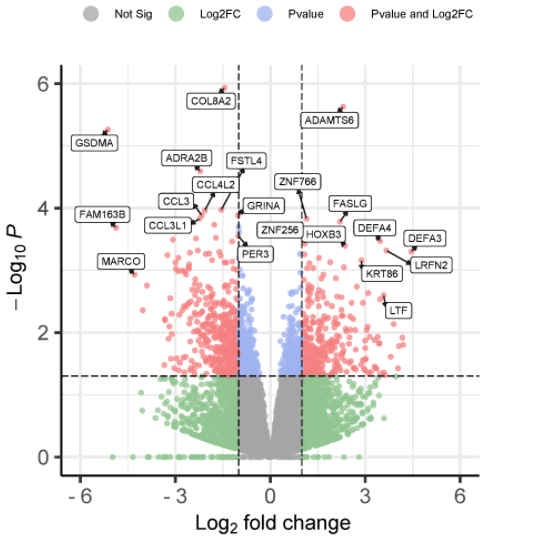
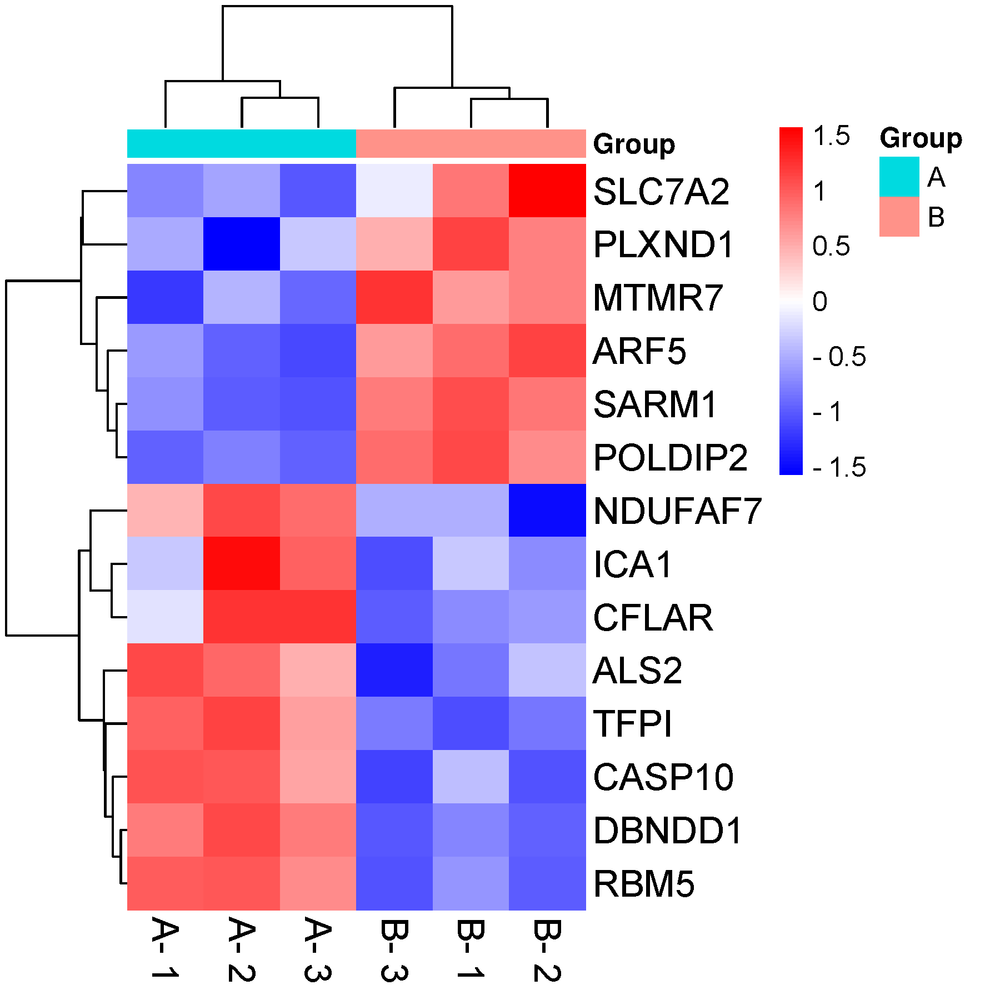
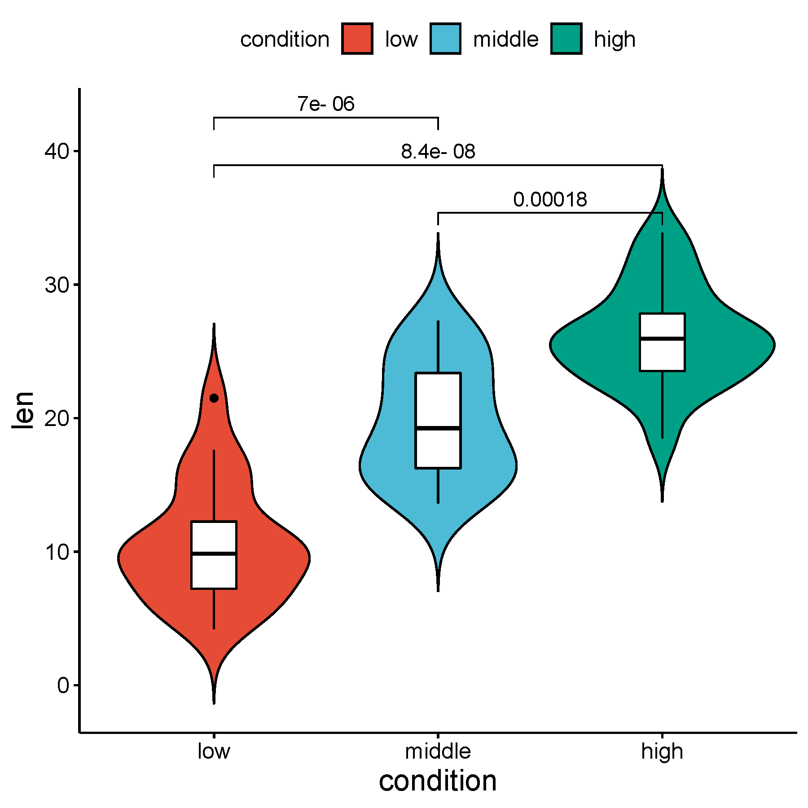

# 生物信息学

## 基因表达数据分析

### Linux基本操作

Linux使用命令行时：   一个字符都不能多！一个字符都不能少！一个字符都不能错！   
例如：文件本来是chr21.fa 输入：（以下全是错的，为什么）   Chr21.fa chr21.fa.zip chr21. fa chr21（1）.fa  
 
### 数据比对与定量
1. 索引构建

bowtie2-build chr21.fa chr21

2. 比列对比

bowtie2 -x chr21 -1 test_1.fastq -2 test_2.fastq -S alignment.sam -p 4 --very-sensitive --no-unal 

3. 定量分析

SAMtools，featureCounts，HTSeq-count

4. 差异分析

DESeq2，EdgeR，limma

### 数据可视化

  
      
      
      

  

数据文件（下载方式：点击链接，原始数据，右键另存）
- [ExpressionMatrixData（基因表达矩阵）](./files/ExpressionMatrixData.txt)  
- [DifferentExpressionData（差异表达结果）](./files/DifferentExpressionData.txt)  
- [SampleInformationData（样本信息文件）](./files/SampleInformationData.txt)  
- [整合Excel文件](./files/基因表达示例数据.xlsx)  

思考：基因表达矩阵和差异表达结果，这两类数据格式上有什么区别？

<b>基因表达数据：</b> 
行是基因，列是样本，数值是表达值。 </b>
<b>差异表达结果：</b> 
Gene：基因名称。 
Log2FoldChange：基因在Case组与Control组之间的表达倍数变化，以对数2为底。如果为正值，表示Case组中表达水平高于Control组；如果为负值，表示Case组中表达水平低于Control组。 
P-value：统计检验的p值，用于评估差异表达的显著性。小于0.05通常被认为是显著的。 
Q-value：经过多重检验校正后的p值（如FDR），通常用于评估在多次比较中假阳性率的控制。小于0.05通常被认为是显著。 
Significance：根据P-value或Q-value结果评定的显著性分类（如Significant或Not Significant）。 

### 可视化在线工具

https://www.bic.ac.cn/BIC/#/  

https://www.chiplot.online/ 

https://www.bioinformatics.com.cn/ 

